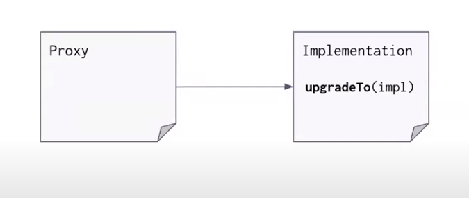

# EVM Proxy 

This contract contains the script and source code demo for a better understanding of Proxy in EVM, as well as providing scripts to use Openzeppelin Upgradable Proxy using Hardhat 

Three criterias: 
- Transparent Proxy 
- UUPS Pattern

### Abstract 
What is contract upgradable? How can we upgrade the contract? 

- Migrate contract V1 -> V2 
- ... 
- Proxy Upgrade using delegate call

### Transparent Proxy 
Transparent proxy implements a proxy contract that is upgradable via an admin contract
The upgrability function is implemented in the proxy contract.

  - If any account other than the admin calls the proxy, the call will be forwarded to the implementation 

  - If the admin call the proxy, it can access the admin function, but it calls will never go to the implemenetation

- Openzeppelin using an Admin contract to manage contract upgrade

### UUPS Proxy 
Transparent proxy implements a proxy contract that is upgradable via a custom proxy admin
The upgrability function is implemented in the implementation contract.

### Comparision 

| Security                                            | Transparent Proxy                                      | UUPS Proxy                                                                                                                        |
| --------------------------------------------------- | ------------------------------------------------------ | ---------------------------------------------------------------------------------------------------------------------------------- |
| Deployment Fee                                      |  ~ 1200k                                               |  390k limit                                           |
| Implementation Deployment | + 0 |+ 320k |
| Runtime overhead | 7.3k | 4.9k |
| Implementation process | Complex + risk of killing upgrades | Easy to implement + no risk of killing upgrades |
| Security | Avoid Clasing Selector | Avoid Clasing Selector |

### Appendixes
 - Upgradable pattern: https://docs.openzeppelin.com/upgrades-plugins/1.x/proxies
 - Openzeppelin proxy docs: https://docs.openzeppelin.com/contracts/3.x/api/proxy
 - Openzeppelin proxy github: https://github.com/OpenZeppelin/openzeppelin-contracts/tree/master/contracts/proxy
 - Malicious backdoor: https://medium.com/nomic-foundation-blog/malicious-backdoors-in-ethereum-proxies-62629adf3357
 - Using UUPS: https://blog.logrocket.com/using-uups-proxy-pattern-upgrade-smart-contracts/

  

