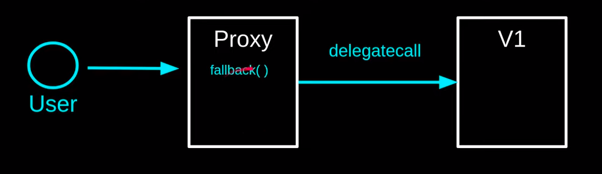

# EVM Proxy 

This contract contains the script and source code demo for a better understanding of Proxy in EVM, as well as providing scripts to use Openzeppelin Upgradable Proxy using Hardhat 

Three criterias: 
- Raw proxy
- Transparent Proxy 
- UUPS Pattern

### Abstract 
What is proxy ?? 

### Dependencies 

### Contracts

### Appendixes
 - https://docs.openzeppelin.com/contracts/3.x/api/proxy
 - https://github.com/OpenZeppelin/openzeppelin-contracts/tree/master/contracts/proxy

