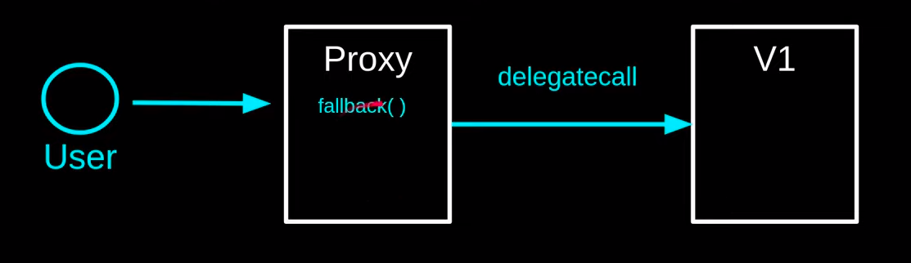
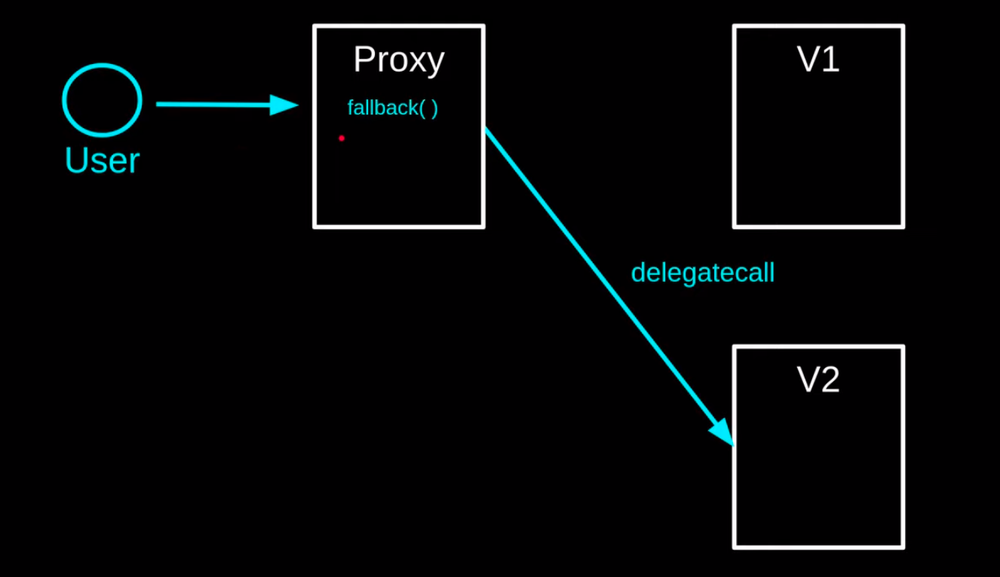
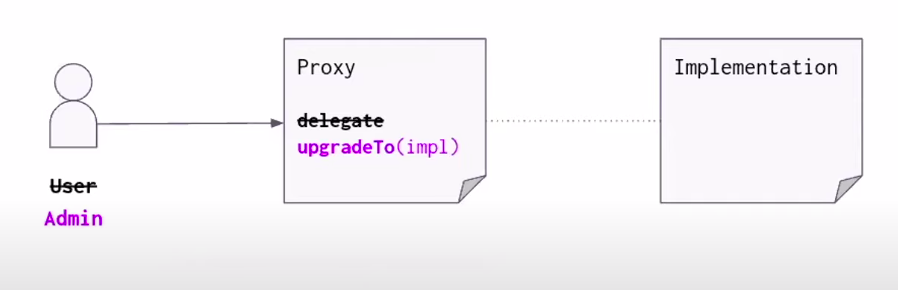
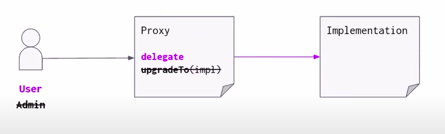
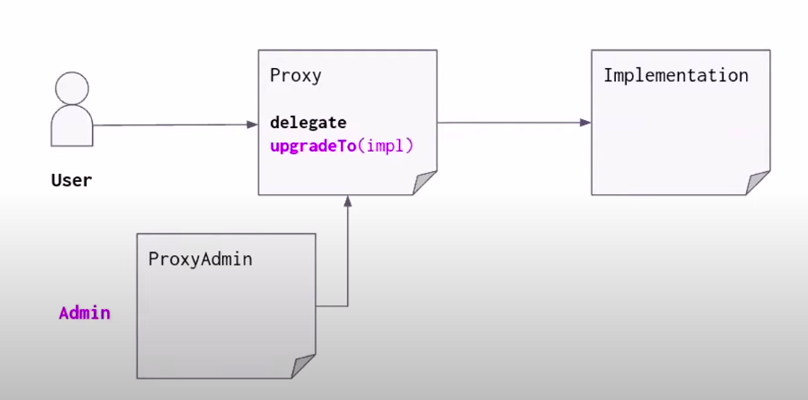
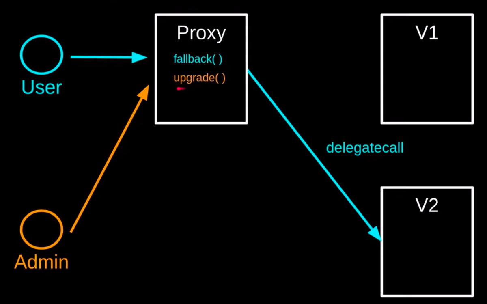

# EVM Proxy 

This contract contains the script and source code demo for a better understanding of Proxy in EVM, as well as providing scripts to use Openzeppelin Upgradable Proxy using Hardhat 

Three criterias: 
- Transparent Proxy 
- UUPS Pattern

### Abstract 
What is contract upgradable? How can we upgrade the contract? 

- Migrate contract V1 -> V2 
- ... 
- Proxy Upgrade using delegate call

### Transparent Proxy 

Transparent proxy implements a proxy contract that is upgradable via proxy an admin
  - If any account other than the admin calls the proxy, the call will be forwarded to the implementation 

  - If the admin call the proxy, it can access the admin function, but it calls will never go to the implemenetation

Openzeppelin using an Admin contract to manage contract upgrade

### UUPS Proxy 

### Appendixes
 - https://docs.openzeppelin.com/contracts/3.x/api/proxy
 - https://github.com/OpenZeppelin/openzeppelin-contracts/tree/master/contracts/proxy

